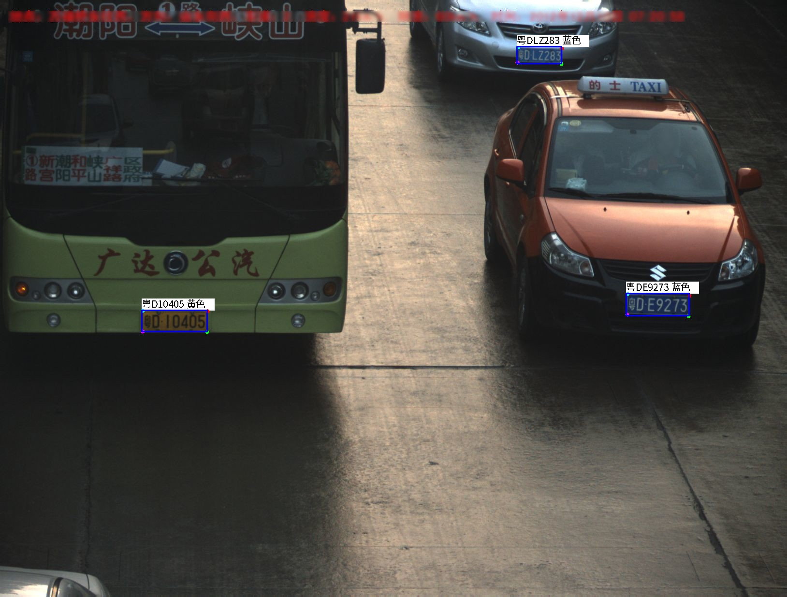
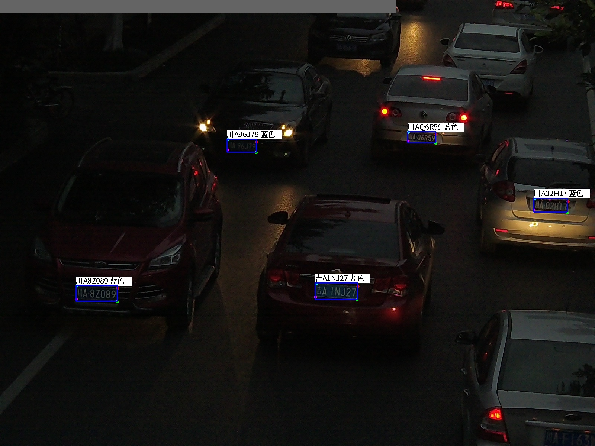
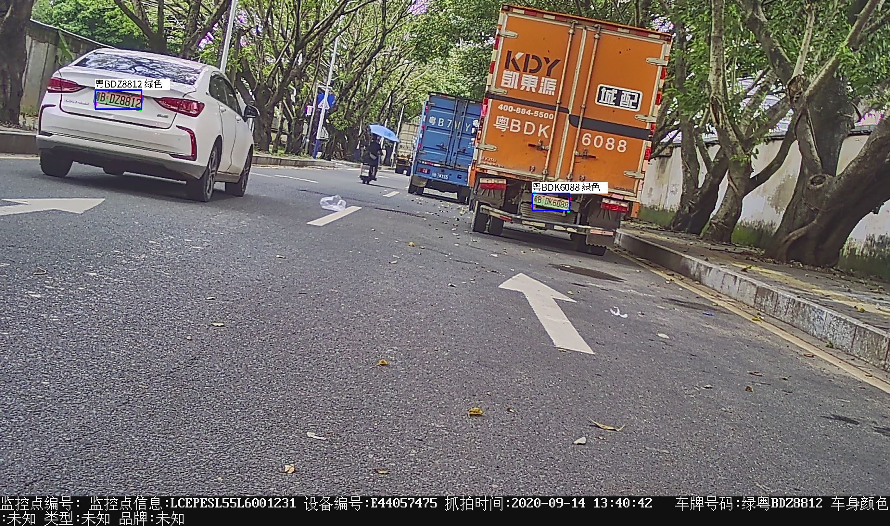
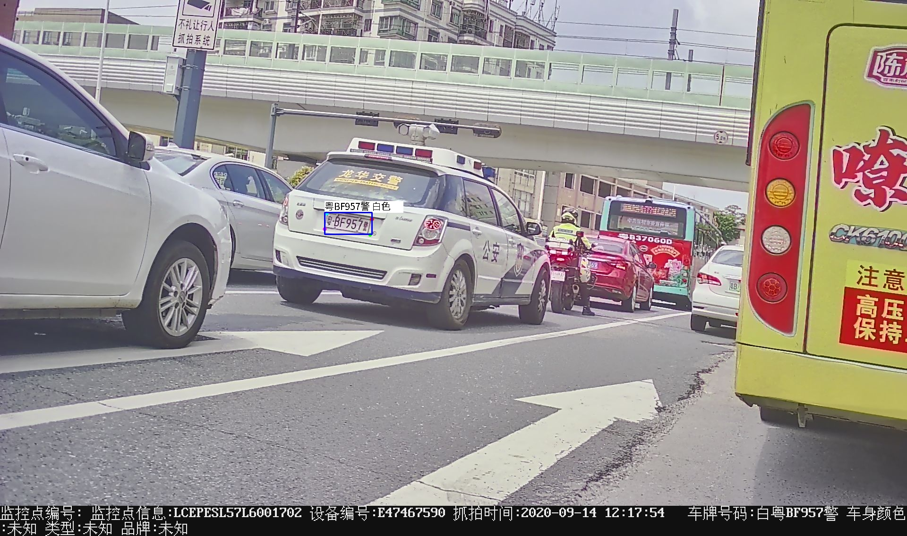
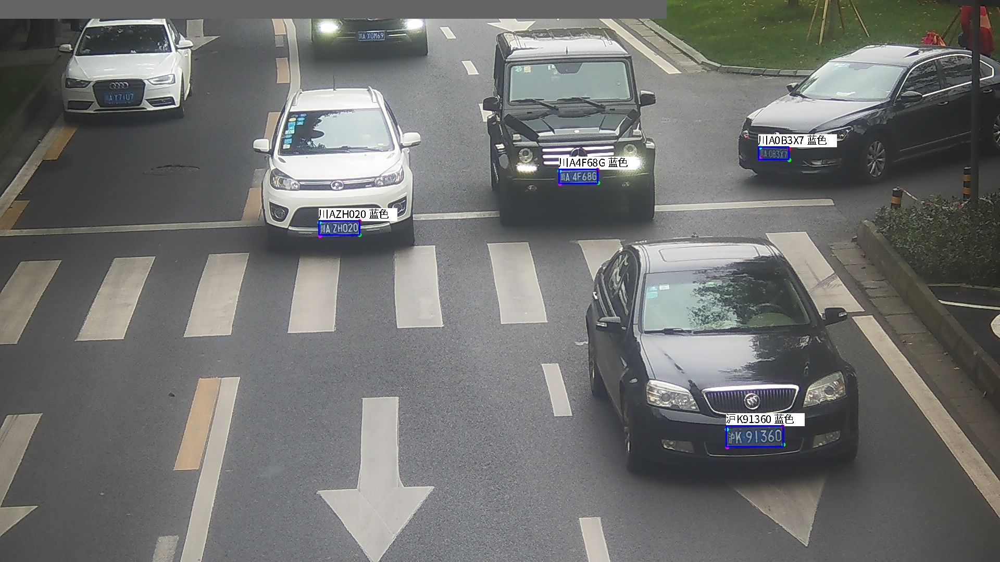
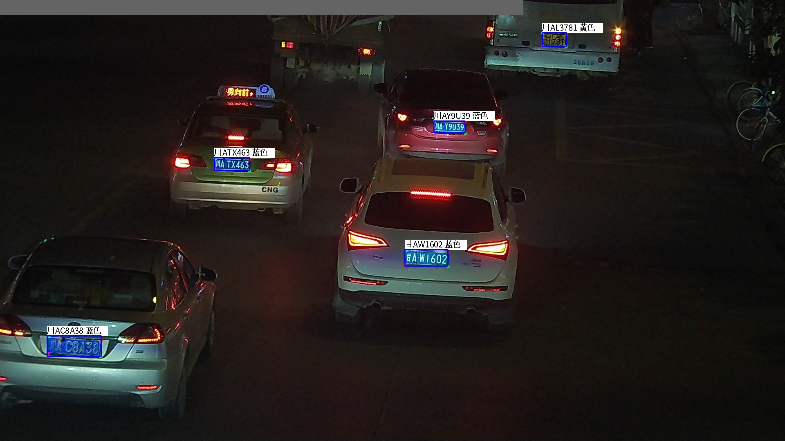
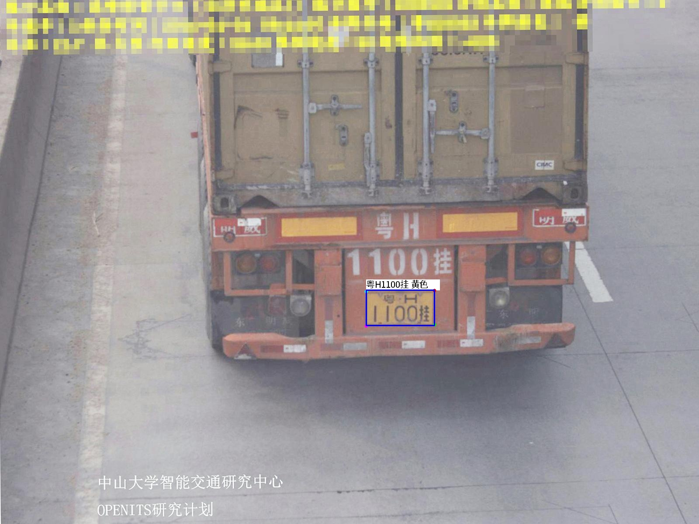
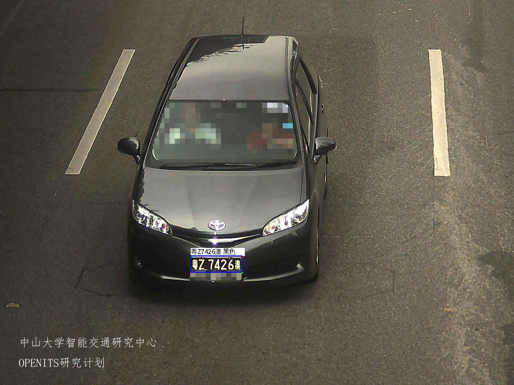

简体中文 | [English](./README_en.md)

如果觉得有用，不妨给个Star⭐️🌟支持一下吧~ 谢谢！

# Acknowledgments & Contact 
### 1.WeChat ID: cbp931126
1. 加入讨论群(备注：PlateAlgorithm),大佬多多多卷卷卷；
2. 进讨论群可以获得10G大小的车牌检测和识别数据；

# Web Test
大陆车牌识别、港澳车牌识别、台湾车牌识别在线体验:http://zhoujiayao.com:8200/

## 特性
1. 支持Linux/Win/Centos/Ubuntu下CPU、GPU部署，支持定制化开发
2. 支持Android、uniapp部署
3. 支持瑞芯微rv1106/rv1106/rk3588/rk3568等侧端部署
   | 型号 |速度|精度 |接口|
   |:----------:|:----------:|:----------:|:----------:|
   |rk3588           |18ms|       99%+    |C/C++、python|
   |rk3568 	         |70ms|       99%+    |C/C++、python|
   |rv1126 	         |62ms|       99%+    |  C/C++     |
   |rv1106 	         |158ms|      99%+    |  C/C++     |

4. 支持算能BM1684系列侧端部署
5. 支持爱芯系列侧端部署:
6. 支持海思系列侧端部署:SS928/Hi3403/Hi3519DV500/Hi3516DV500/Hi3516DV300/Hi3516CV610等
7. Linux/Win/Centos/Ubuntu下支持TensorRT、OnnxRuntime、OpenVINO、NCNN等框架推理，支持C/C++，python，C#,Java等语言调用

## 识别效果
 
 
 
 

# PlateAlgorithm
## **车牌识别算法，支持12种中文车牌类型**
**1.单行蓝牌**
**2.单行黄牌**
**3.新能源车牌**
**4.白色警用车牌**
**5 教练车牌**
**6 武警车牌**
**7 双层黄牌**
**8 双层武警**
**9 使馆车牌**
**10 港澳牌车**
**11 双层农用车牌**
**12 民航车牌**

## 说明
1. 车牌检测(yolov5plate,yolov7plate,yolov8playe),车牌校正，车牌识别，车牌检测识别;
   
   | 文件夹 | State    |  说明   |
   |:----------|:----------|:----------|
   |PLateDetection_yolov5                 |Done|           yolov5 车牌检测              |
   |PLateDetection_yolov7 				      |Done|           yolov7 车牌检测              |
   |PLateDetection_yolov8 				      |Doing|          yolov8 车牌检测              |
   |PlateRecognition 				         |Done|           车牌识别                     |
   |PlateDetectionRecognition 				|Done|           车牌检测->车牌校正->车牌识别    |
   
2. 所有模型均使用C++和TensorRT加速推理,yolov7plate的前后处理使用cuda加速,(其他模型加速优化也可参考);
3. 根据不同的显卡型号自动生成对应的engine(如果文件夹下有其他显卡适配engine，则删除engine才能重新生成使用中的显卡对应的engien);
4. PlateDetectionRecognition->test->main.cpp文件中的条件编译测试说明
	| 测试类别 |  enable    |  说明   |
	|:----------|:----------|:----------|
   |yolov5_plate                 |1|           yolov7车牌检测               |
   |yolov7_plate 				      |1|           yolov5 车牌检测              |

5. 车牌识别准确率(测试集数量:5.2w张)
   | 模型 |  size    |  准确率   |速度| 平台|
	|:----------:|:----------:|:----------:|:----------:|:----------:|
   |plate_recognition_color|s|   92.40%|452.480us|RTX3090|
   |plate_recognition_s    |s|   98.90%|452.597us|RTX3090|
   |plate_recognition_m    |m|   99.35%|463.316us|RTX3090|
   |plate_recognition_l    |l|   99.56%|507.082us|RTX3090|


## 算法说明

# 算法接口
```
/** 
 * @brief                  车牌初始化函数
 * @param config           模块配置参数结构体
 * @return                 HZFLAG
 */
void*Initialize(Config*config);

/** 
 * @brief                  车牌检测识别(yolov5)
 * @param img              Plate_ImageData
 * @param PlateDet         车牌检测识别结果列表
 * @return                 HZFLAG
 */		
int PlateRecognition_yolov5(void*p,Plate_ImageData*img,PlateDet*PlateDets);

/** 
 * @brief                  车牌检测(yolov7_plate)
 * @param img              Plate_ImageData
 * @param PlateDet         车牌检测识别结果列表
 * @return                 HZFLAG
 */		
int PlateRecognition_yolov7(void*p,Plate_ImageData*img,PlateDet*PlateDets);


/** 
 * @brief                  车牌检测(yolov8_plate)
 * @param img              Plate_ImageData
 * @param PlateDet         车牌检测识别结果列表
 * @return                 HZFLAG
 */		
int PlateRecognition_yolov8(void*p,Plate_ImageData*img,PlateDet*PlateDets);

/** 
 * @brief                  反初始化
 * @return                 HZFLAG 
 */		
int Release(void*p,Config*config);
```

## 2.环境
1. ubuntu20.04+cuda11.1+cudnn8.2.1+TensorRT8.2.5.1(测试通过)
2. ubuntu18.04+cuda10.2+cudnn8.2.1+TensorRT8.2.5.1(测试通过)
3. Win10+cuda11.1+cudnn8.2.1+TensorRT8.2.5.1      (测试通过)
4. 其他环境请自行尝试或者加群了解


## 3.编译
1. 更改根目录下的CMakeLists.txt,设置tensorrt的安装目录
```
set(TensorRT_INCLUDE "/xxx/xxx/TensorRT-8.2.5.1/include" CACHE INTERNAL "TensorRT Library include location")
set(TensorRT_LIB "/xxx/xxx/TensorRT-8.2.5.1/lib" CACHE INTERNAL "TensorRT Library lib location")
```
2. 默认opencv已安装，cuda,cudnn已安装
3. 为了Debug默认编译 ```-g O0``` 版本,如果为了加快速度请编译Release版本

4. 使用Visual Studio Code快捷键编译(4,5二选其一):
```
   ctrl+shift+B
```
5. 使用命令行编译(4,5二选其一):
```
   mkdir build
   cd build
   cmake ..
   make -j6
```

# References
1. https://github.com/deepcam-cn/yolov5-face
2. https://github.com/derronqi/yolov7-face/tree/main
3. https://github.com/we0091234/yolov7-face-tensorrt
4. https://github.com/derronqi/yolov8-face
5. https://github.com/we0091234/crnn_plate_recognition
6. https://github.com/we0091234/Chinese_license_plate_detection_recognition   
